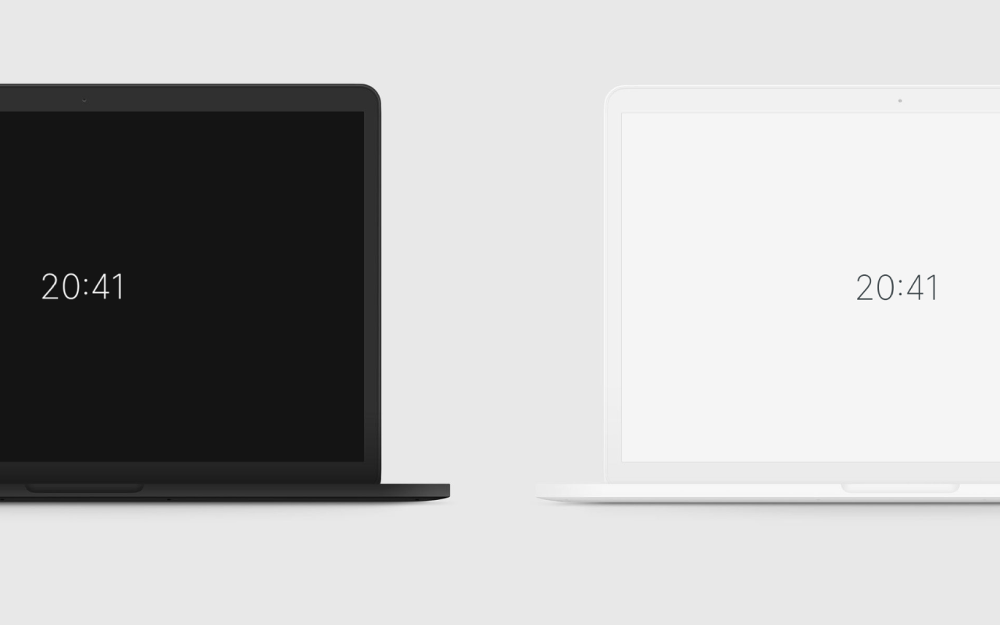

# Good Times
> Minimal, distract-free timepiece for the modern human

Sometimes you just want a "at glance"-awareness of where you are in relation to your day.

**Good Times** is the `New tab` page for the modern professional that has too many notifications and distractions in life, dissuading their productivity.

By subtlety appearing when you open a new tab in your browser it allows you to focus on what you're currently doing without losing track of the day.

## Features
### Adapt the timepiece to your language
**Good Times** will adapt the clock to the language you have set in your browser. You can override this by explicitly selecting which language to base the formatting on through the *Preferences*.

### Light & Dark Mode support
Has three modes:
* **Automatic**: Inherits your preferences from your operating system.
* **Dark**: Always use a dark color theme.
* **Light**: Always use a light color theme.
